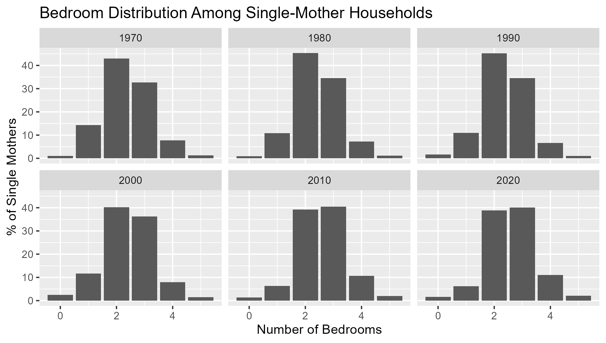
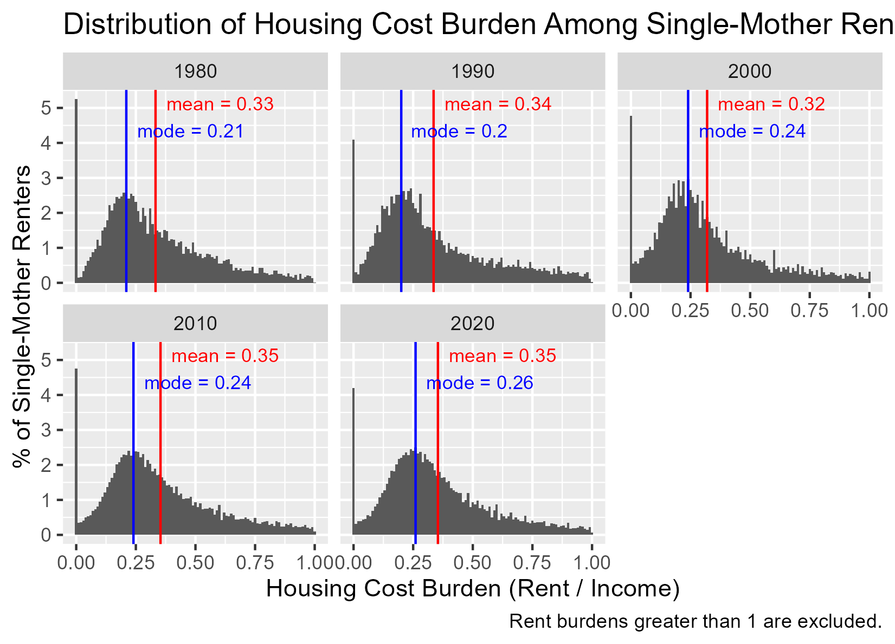
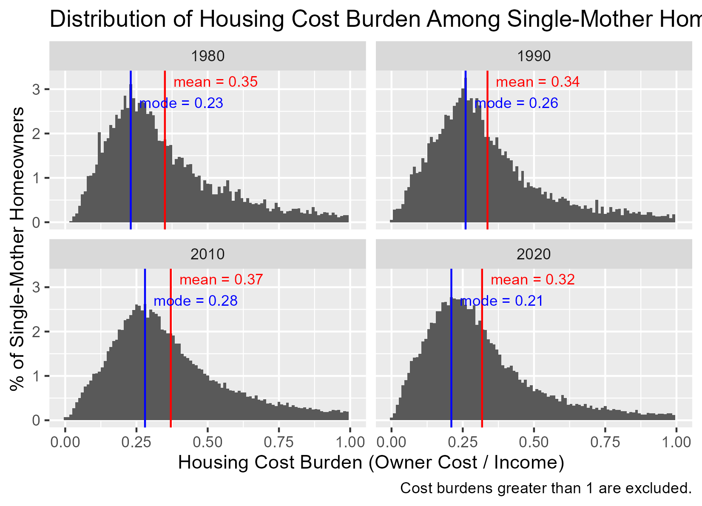
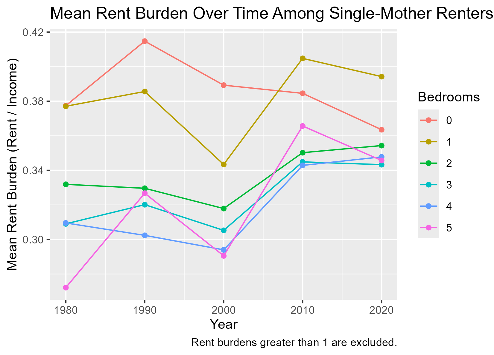

```{r setup, include=FALSE}
knitr::opts_chunk$set(echo = FALSE, warning = FALSE, message = FALSE)
```

# Introduction

It's evident we live in larger units than before. But are people trading off between space and cost, or are both rising together?

Evidence of higher space consumption and higher housing cost together could indicate "forced overconsumption," an idea brought up in lab meeting. Are people more cost burdened today than they were in the past because they can't access smaller units they would have rented or owned 50 years ago? 

For this initial analysis we focus on a very particular subset of the population: the single-mother household. This is an easy-to-measure subset of the population that is typically more cost-constrained (and thus more likely to show this overconsumption pattern, than, say, single adults, more of whom may be very wealthy). We narrowly define a single-mother household as a non-institutional household (IPUMS `GQ %in% c(0, 1, 2)`) in which every member is either the householder or one of her children (`RELATE` equals 1 or 3 only), the householder is female, and every child is under age 18. Households with adult children, other relatives, roommates, or partners are excluded. All results use IPUMS USA decennial and ACS 5-year microdata from six time points (1970, 1980, 1990, 2000, 2008–2012, and 2018–2022) and are weighted using `HHWT` (and, where applicable, `PERWT`). There are roughly 400,000 households in this analysis.

We establish a very basic fact: Are cost burdens rising because of a composition effect (people living in units with more bedrooms) or are cost burdens rising in addition to the higher space consumption? 

The answer is that housing cost burdens are rising in excess of higher space consumption. Despite rising real incomes, cost burden is rising among single-mother renters, and the cost burden for, say, a 2-bedroom household in 2020 is higher for a typical single mother than it was in 1980.

There is a large caveat: Despite statistical significance, the final regressions show very little explanatory power, suggesting there is a larger story explaining cost burden. NEighborhood characteristics are notably absent and may be a large part of the story.


# Table 1 — Sample composition by decade

Before diving into the housing-cost analysis, Table 1 shows weighted descriptive statistics for single-mother households in each decade: sample size, mean householder age, mean (unadjusted) household income, mean bedrooms and number of children, tenure shares, and race/ethnicity composition. All statistics except the unweighted `n` use `HHWT`. This matters because the narrowly-defined single-mother household is very differently selected across decades — in 1970 it may have been more rare and skewed more toward widows and divorcees in a restrictive legal environment.

Descriptive statistics of these households show changes over time. Mean householder age fell and then rose slightly, with the mean single mother in 2020 just two years older than her counterpart in 1970. The renter share has risen slightly — by about 2 percentage points. Income, even adjusted to 2022 dollars using the R-CPI-U-RS series, has risen substantially over the 40-year period for which it is measured. Corresponding with broader demographic changes witnessed over this period, the Multiracial, AAPI, and Hispanic shares of single mothers have all risen.


```{r table1}
readr::read_csv("../output/tables/fig05-table1-sample-composition-by-decade.csv", show_col_types = FALSE) |>
  knitr::kable(digits = 2)
```

# Fig 02 — Bedroom distribution by decade

Figure 2 shows the weighted share of single-mother households occupying 0, 1, 2, 3, 4, or 5+ bedrooms, faceted by decade. Bedrooms are recoded from IPUMS' `BEDROOMS` variable so that 0 = no bedrooms / studio and 5 = five or more. The panels clearly document that single-mother families are living in units with more bedrooms over time. This isn't a fertility story: mean bedrooms rose from 2.36 in 1970 to 2.59 in 2020 *while* the mean number of children fell from 2.41 to 1.82 over the same period (see Table 1). 

```{r fig02}

```

# Fig 03a — Rent cost burden distribution by decade (renters)

Figure 3a shows the weighted distribution of rent burden — monthly rent × 12 divided by annual household income — among single-mother renters, restricted to burdens ≤ 1 and binned into 0.01-wide intervals. The red line marks the weighted mean and the blue line marks the modal bin in each decade. 1970 is omitted because `HHINCOME` is not available in IPUMS USA for 1970. Rent burden has been rising since 1980.
```{r fig03a}

```

# Fig 03b — Owner cost burden distribution by decade (homeowners)

Similarly, we document owner cost burden in figure 3b. 2000 is omitted because `OWNCOST` is not available in the 2000 1% IPUMS USA sample — it is only present in the 5% sample and the ACS. (Future exploration can pull from this survey to get 2000 data). 1970 is omitted for the same reason as Fig 3a (no `HHINCOME`). Owner cost burden appears to have risen through 2010 and then decreased slightly by 2020.

```{r fig03b}

```

# Fig 04 — Mean rent burden over time by bedrooms

It is really the question of combined rent burden and bedroom size that bears on "forced overconsumption". Is it the case that people live in larger homes and simultaneously spend more of their income on them? Figure 4 appears to show a net decline in rent burden among single-mother renters of studios, and a net increase among all the rest. Rent burden appeared to move downward for most up until 2000 and then upward after that.

These graphs do not control for other observed variables, an issue we will attempt to resolve in the next section.

```{r fig04}

```

# Fig 05 — Regression results

Among single mothers, we show a progression of regression results that estimate housing cost burden. Model 1 shows that decade-over-decade, housing cost burden grows by 0.4 percentage points, and that relative to a studio-dwelling single-mother household, 2- to 4-bedroom households have 3.3–4.6 pp lower burden (1-bedroom households are indistinguishable from studios). Model 2 adds tenure: homeowners show a ~1 pp higher burden than renters, likely partly an artifact of `OWNCOST` bundling mortgage principal with actual consumption. Model 3 adds householder age — each additional year is associated with a 0.2 pp lower burden, consistent with income rising over a career. Despite consistent statistical significance (the sample is ~400,000 households), R² remains very low through Model 3.

Model 4 adds race and Hispanic origin as separate categorical controls (with white non-Hispanic as the reference), and Model 5 adds state fixed effects. The largest changes in the race/ethnicity coefficients arise through these state controls: the Black coefficient drops from −0.007 to essentially zero when state FE is added, and the AAPI coefficient shrinks from +0.029 to +0.007 — indicating that a meaningful share of the observed racial and ethnic differences in cost burden reflects *where* different groups live rather than within-state differences. The Hispanic coefficient shrinks too (from +0.048 to +0.035) but remains strongly positive, suggesting a within-state component. R² increases from 0.016 to 0.035 from adding state dummies.

Model 6 allows bedrooms and time to interact, meaning each bedroom size has its own linear time slope (linearity in time appears approximately reasonable based on Figure 4). All non-studio bedroom sizes show positive time trends *above* the (essentially flat) studio trend, meaning housing cost burden has grown at a rate that exceeds studios — particularly for 2-, 3-, and 5+-bedroom units, which rise by roughly 0.6–0.7 pp per decade. Since the vast majority of single-mother households live in 2- and 3-bedroom homes, this interaction matters substantively: the rising-burden story is concentrated in the unit sizes that single-mother families actually occupy. Notably, this rise in cost burden occurs *despite* substantial gains in real income for single-mother households — Table 1 shows mean `HHINCOME` in 2022 dollars rising from roughly $28k in 1980 to $44k in 2020 — implying that rent growth has outpaced income growth at exactly these unit sizes.

```{r fig04-table, results='asis'}
htmltools::includeHTML("../output/tables/fig04-single-mother-rent-burden-regressions.html")
```

A couple of caveats about these regressions. Point estimates are correctly weighted using household weights (`HHWT`), but the standard errors are misrepresented because the regressions are fit with `lm()` rather than a survey-design-aware package like `srvyr` or `survey::svyglm()`. In addition, the outcome variable of interest — cost burden — is restricted to the population for which cost burden is less than 1. It is unclear why there are so many observations above 1 (plausibly measurement issues in `HHINCOME`, particularly at the low end), and how changing the outcome (e.g. using cost burden for everyone, top-coding at 1, or using residual income) may change the results.

# Conclusion

This analysis documents that single-mother households are simultaneously consuming more space (rising bedrooms per household) and paying more for it (rising cost burden at 2-, 3-, and 5+-bedroom units) — and that this is happening alongside substantial real-income gains over the same period. In other words, real rent growth has outpaced real income growth at exactly the unit sizes single-mother families occupy.

But the analysis cannot answer *why*. None of the work above reveals what housing supply was available to single mothers. A "forced overconsumption" story, in which smaller units disappeared from the housing stock and pushed single mothers into larger, more expensive ones, is consistent with the pattern here — but so are voluntary upsizing driven by higher incomes, preference shifts, composition change within the single-mother population (some of which is controlled for above).

These effects are small are relative to the overall variation in cost burden. In practical terms, the time trends documented here are a faint signal sitting on top of enormous unexplained variation. The single biggest jump in R² across specifications came from adding state fixed effects (0.016 → 0.035), suggesting that we are likely to recover some missing variation by introducing finer geographic variables. These are unavailable using the current samples, but could be found if we moved the project onto the Census space and/or were clever with surveys and samples.

That geographic signal motivates the natural next step: look directly at the housing stock, and do so at a finer geography than state. We could incorporate other sources, such as the Rental Housing Finance Survey, for information on both occupied and unoccupied stock. Pairing that supply-side measure with the rent and cost-burden trends documented here — particularly at the metro or neighborhood level, perhaps starting within one or a handful of locations — would let us see whether the available housing stock in a given region seems to be a plausible constraint on the units single mothers occupy and the burdens they bear.

Of course, this analysis would ideally generalize to other groups as well, beyond single-mother families. Single-mother families were primarily a convenience sample.

# Proposed Next Steps

1. **Pull a richer data source and pick one geography.** Pull the Rental Housing Finance Survey (or a comparable source — AHS, HUD CHAS, or tract-level ACS) and select a single metro or state with strong demographic and housing data to start. The goal is to get beyond state as the finest unit of analysis. This might be best done in the Census space.

2. **Rerun the analysis at finer geography.** Rerun the single-mother cost-burden analysis for the chosen geography, ideally with demographic controls *and* tract- or neighborhood-level controls for housing stock and market conditions.

3. **Plot residual cost burden against housing availability.** Using the residuals from the above specification, plot neighborhood-level residual housing burden against a measure of unit availability (e.g., share of studios and 1-bedrooms in the local rental stock, vacancy rate by unit size, or similar) to see whether residual burden correlates with the kind of supply constraints a "forced overconsumption" story would predict.

4. **Choose other subgroups.** Perform similar analysis on other household types. 


