# Data flow

Data flow diagram for `five-decade-aggregates/` pipeline. See `run-all.R` for execution order.

## Legend

| Shape | Meaning |
|---|---|
| Rectangle | Script |
| Cylinder | Database / data file |
| Cylinder (pale, dotted) | Intermediate / temporary data |
| Stadium (rounded) | External input (API, config) |

## Diagram

```mermaid
%%{init: {"flowchart": {"defaultRenderer": "elk"}, "themeVariables": {"fontSize": "14px"}} }%%
flowchart TD
    classDef script fill:#4a90d9,color:#fff,stroke:#2c5f8a
    classDef data fill:#5cb85c,color:#fff,stroke:#3d8b3d
    classDef intermediate fill:#5cb85c22,color:#888,stroke:#3d8b3d,stroke-dasharray:5 5
    classDef input fill:#f0ad4e,color:#fff,stroke:#c87f0a

    %% --- Top row: external inputs (order controls left-to-right placement) ---
    ipums_api(["IPUMS USA API"]):::input
    env([".Renviron (IPUMS_API_KEY)"]):::input
    cps_api(["IPUMS CPS API"]):::input

    %% --- Import: IPUMS USA ---
    import_usa["src/<br>import-ipums-usa-1970-2020.R"]:::script
    raw_usa[("data/raw-microdata/<br>usa_NNNNN.xml + .dat.gz")]:::intermediate
    ipums_db[("data/five-decade-db/ipums.duckdb<br>(table: ipums)")]:::data

    %% --- Import: IPUMS CPS ---
    import_cps["src/<br>import-ipums-cps-1970-2020.R"]:::script
    raw_cps[("data/raw-microdata/<br>cps_NNNNN.xml + .dat.gz")]:::intermediate
    cps_db[("data/five-decade-db/ipums_cps.duckdb<br>(table: ipums)")]:::data

    ipums_api --> import_usa
    env --> import_usa
    import_usa --> raw_usa
    import_usa --> ipums_db
    raw_usa --> ipums_db

    env --> import_cps
    cps_api --> import_cps
    import_cps --> raw_cps
    import_cps --> cps_db
    raw_cps --> cps_db

    %% --- Process: IPUMS USA person-level ---
    inflators(["reference/<br>inflators-1970-2020.csv"]):::input
    demographr(["../demographr"]):::input
    process_usa["src/<br>process-ipums-usa-person-1970-2020.R"]:::script
    ipums_person_db[("data/five-decade-db/ipums.duckdb<br>(table: ipums_person)")]:::data

    ipums_db --> process_usa
    inflators --> process_usa
    demographr --> process_usa
    process_usa --> ipums_person_db

    %% --- Process: IPUMS CPS person-level ---
    process_cps["src/<br>process-ipums-cps-person-1970-2020.R"]:::script
    cps_person_db[("data/five-decade-db/ipums_cps.duckdb<br>(table: ipums_person)")]:::data

    cps_db --> process_cps
    demographr --> process_cps
    process_cps --> cps_person_db

    %% --- Process: CPS household interrelationships ---
    cps_interrel["src/<br>cps-household-interrelationships.R"]:::script
    cps_subfam_db[("data/five-decade-db/ipums_cps.duckdb<br>(table: ipums_person_with_subfamilies_over18)")]:::data

    cps_person_db --> cps_interrel
    demographr --> cps_interrel
    cps_interrel --> cps_subfam_db

    %% --- Tables: household/bedroom/crowding overall ---
    gen_hh_crowding["src/tables/<br>generate-household-bedroom-crowding-overall.R"]:::script
    hhsize_overall[("output/raw/<br>hhsize_decade_overall.csv")]:::data
    bedroom_overall[("output/raw/<br>bedroom_decade_overall.csv")]:::data
    ppbr_overall[("output/raw/<br>ppbr_decade_overall.csv")]:::data
    cps_hhsize_overall[("output/raw/<br>cps_hhsize_decade_overall.csv")]:::data

    ipums_person_db --> gen_hh_crowding
    cps_person_db --> gen_hh_crowding
    demographr --> gen_hh_crowding
    gen_hh_crowding --> hhsize_overall
    gen_hh_crowding --> bedroom_overall
    gen_hh_crowding --> ppbr_overall
    gen_hh_crowding --> cps_hhsize_overall

    %% --- Tables: crowding overall by subgroup ---
    setup(["src/helpers/<br>setup.R"]):::input
    gen_crowding_subgroup["src/tables/<br>generate-crowding-overall-subgroup.R"]:::script
    crowding_subgroup_csvs[("output/raw/<br>crowded_*.csv, ppbr_*.csv<br>(11 files by subgroup)")]:::data

    ipums_person_db --> gen_crowding_subgroup
    demographr --> gen_crowding_subgroup
    setup --> gen_crowding_subgroup
    gen_crowding_subgroup --> crowding_subgroup_csvs

    %% --- Tables: crowding by state and decade ---
    gen_crowding_state["src/tables/<br>generate-crowding-state-decade.R"]:::script
    crowding_state_csvs[("output/raw/<br>hhsize/bedroom/ppbr/crowded<br>_state_decade.csv (4 files)")]:::data

    ipums_person_db --> gen_crowding_state
    demographr --> gen_crowding_state
    setup --> gen_crowding_state
    gen_crowding_state --> crowding_state_csvs

    %% --- Tables: crowding changes by state 1970-2020 ---
    gen_crowding_state_change["src/tables/<br>generate-crowding-changes-state-1970-2020.R"]:::script
    crowding_state_change_csvs[("output/raw/<br>hhsize/bedroom/ppbr/crowded<br>_state_change_1970_2020.csv (4 files)")]:::data

    crowding_state_csvs --> gen_crowding_state_change
    gen_crowding_state_change --> crowding_state_change_csvs

    %% --- Tables: crowding by age and decade ---
    gen_crowding_age["src/tables/<br>generate-crowding-age-decade.R"]:::script
    crowded_age_csv[("output/raw/<br>crowded_age.csv")]:::data

    ipums_person_db --> gen_crowding_age
    demographr --> gen_crowding_age
    setup --> gen_crowding_age
    gen_crowding_age --> crowded_age_csv

    %% --- Tables: crowding changes by race and age ---
    gen_crowding_race_age["src/tables/<br>generate-crowding-changes-race-age.R"]:::script
    crowding_race_age_csvs[("output/raw/<br>ppbr/crowded/hhsize<br>_race_age_*.csv (6 files)")]:::data

    ipums_person_db --> gen_crowding_race_age
    demographr --> gen_crowding_race_age
    setup --> gen_crowding_race_age
    gen_crowding_race_age --> crowding_race_age_csvs

    %% --- Tables: household size by subgroup ---
    gen_hhsize_subgroup["src/tables/<br>generate-hhsize-subgroup.R"]:::script
    hhsize_subgroup_csvs[("output/raw/<br>hhsize_*.csv<br>(5 files by subgroup)")]:::data

    ipums_person_db --> gen_hhsize_subgroup
    demographr --> gen_hhsize_subgroup
    setup --> gen_hhsize_subgroup
    gen_hhsize_subgroup --> hhsize_subgroup_csvs

    %% --- Tables: household size buckets by race and decade ---
    gen_hhsize_buckets["src/tables/<br>generate-hhsize-buckets-race-decade.R"]:::script
    hhsize_buckets_csv[("output/raw/<br>hhsize-buckets-race-decade.csv")]:::data

    ipums_person_db --> gen_hhsize_buckets
    demographr --> gen_hhsize_buckets
    setup --> gen_hhsize_buckets
    gen_hhsize_buckets --> hhsize_buckets_csv
```

